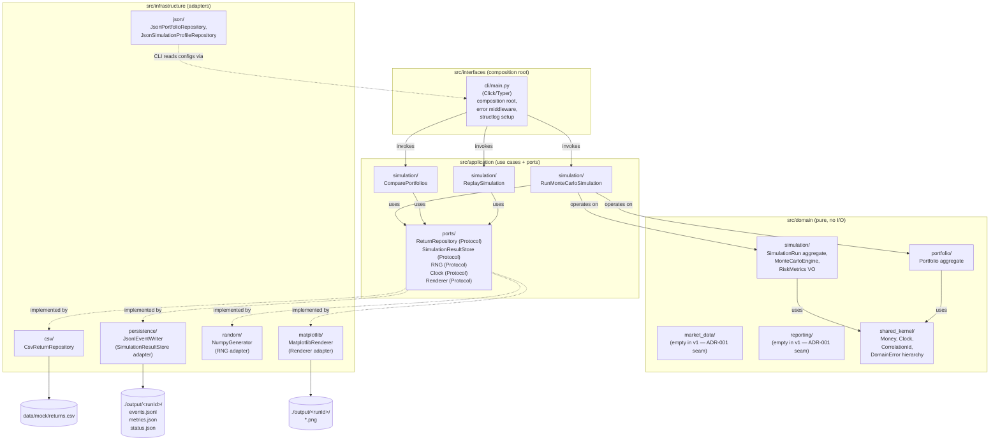

# C4 — Level 2: Container (inside the `mc-risk` container)

> Scope: the internal components of the single Docker container, the ports
> between them, and the technologies on each side of every port. The folder
> layout matches `src/` per ADR-002 and the import-linter contract.

## Diagram (Mermaid)

## Container catalog (matches the folder layout in ADR-002)

| Container | Path | Tech | Responsibility |
|---|---|---|---|
| CLI composition root | `src/interfaces/cli/main.py` | Click/Typer | Parse args, bind `correlationId`, set up `structlog`, wire dependencies, install error middleware. |
| RunMonteCarloSimulation | `src/application/simulation/run.py` | pure Python | Use case orchestrating engine + persistence. |
| ComparePortfolios | `src/application/simulation/compare.py` | pure Python | Two-portfolio back-to-back. |
| ReplaySimulation | `src/application/simulation/replay.py` | pure Python | Reads prior `runId`, re-runs with persisted seed, asserts byte-equality. |
| Ports | `src/application/ports/*.py` | `typing.Protocol` | Interfaces consumed by use cases. |
| Portfolio aggregate | `src/domain/portfolio/portfolio.py` | pure Python | Owns `Holding[]` invariants (weight sum, leverage). |
| SimulationRun aggregate | `src/domain/simulation/run.py` | pure Python | Owns state machine + invariants. |
| MonteCarloEngine | `src/domain/simulation/engine.py` | numpy | The numerical core. |
| Shared kernel | `src/domain/shared_kernel/` | pure Python | `Money`, `Clock`, `CorrelationId`, `DomainError`. |
| CsvReturnRepository | `src/infrastructure/csv/` | stdlib `csv` | Adapter for `ReturnRepository` port. |
| JsonPortfolioRepository | `src/infrastructure/json/` | stdlib `json` + Pydantic | Adapter for portfolio + profile reads. |
| JsonlEventWriter | `src/infrastructure/persistence/` | stdlib `json` + `pathlib` | Adapter for `SimulationResultStore` port (ADR-003). |
| NumpyGenerator | `src/infrastructure/random/` | numpy | Adapter for `RNG` port (ADR-006). |
| MatplotlibRenderer | `src/infrastructure/matplotlib/` | matplotlib | Adapter for `Renderer` port. |

## Port–adapter matrix

| Port (Protocol) | Production adapter | Test adapter |
|---|---|---|
| `ReturnRepository` | `CsvReturnRepository` | `InMemoryReturnRepository` |
| `SimulationResultStore` | `JsonlEventWriter` | `InMemoryEventStore` |
| `RNG` | `NumpyGenerator` | `SeededGenerator` (deterministic, `Generator(42)`) |
| `Clock` | `SystemClock` | `FakeClock` (frozen) |
| `Renderer` | `MatplotlibRenderer` | `NullRenderer` (writes no PNGs) |

## Architectural rule (re-stated from ADR-002 + ADR-010)

- `src/domain/**` imports ONLY `numpy`, `pydantic`, `decimal`, and `src/domain/**`
  + `src/domain/shared_kernel/**`.
- `src/application/**` imports `src/domain/**`, `src/application/ports/**`.
- `src/infrastructure/**` imports `src/application/ports/**` and `src/domain/**`.
- `src/interfaces/**` imports `src/application/**` and `src/infrastructure/**`
  (for wiring only).

Violations fail the `import-linter` CI stage (ADR-010).
