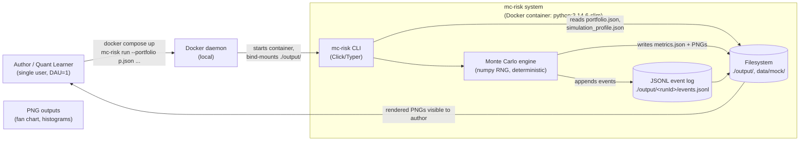

# C4 — Level 1: System Context

> Scope: the entire `mc-risk` system as seen by the author (sole stakeholder).
> No external systems exist in v1 (Defining Q4.1). All "external" arrows in
> this diagram point to the author's own filesystem and to the local Docker
> daemon.

## Diagram (Mermaid)

## Element catalog

| Element | Type | Responsibility |
|---|---|---|
| Author / Quant Learner | Person | Sole stakeholder. Owns the laptop. |
| Docker daemon | External system | Runs the `mc-risk` container; bind-mounts `./output/`. |
| mc-risk CLI | Container boundary | Entry point; parses args, validates inputs, wires dependencies. |
| Monte Carlo engine | Container boundary | Runs the simulation; emits events; writes outputs. |
| JSONL event log | File store | Append-only log per run (ADR-003). |
| Filesystem | File store | `./output/`, `data/mock/returns.csv`. |

## External interfaces

| From | To | Protocol | Notes |
|---|---|---|---|
| Author | Docker daemon | shell | `docker compose up` |
| Docker daemon | CLI | stdin/argv | Container starts; CLI parses args |
| CLI | Filesystem | POSIX read | Portfolio + profile JSON, mock returns CSV |
| Engine | Filesystem | POSIX write | events.jsonl, metrics.json, PNGs |
| Author | Filesystem | POSIX read | Reads PNGs via OS image viewer |

## Constraints inherited from the Defining phase

- **No network.** All I/O is loopback to the author's filesystem.
- **No external vendor.** `MarketData` future-seam is reserved (ADR-001) but
  unused in v1.
- **No concurrent users.** WIP = 1 (Defining Q2.2).
