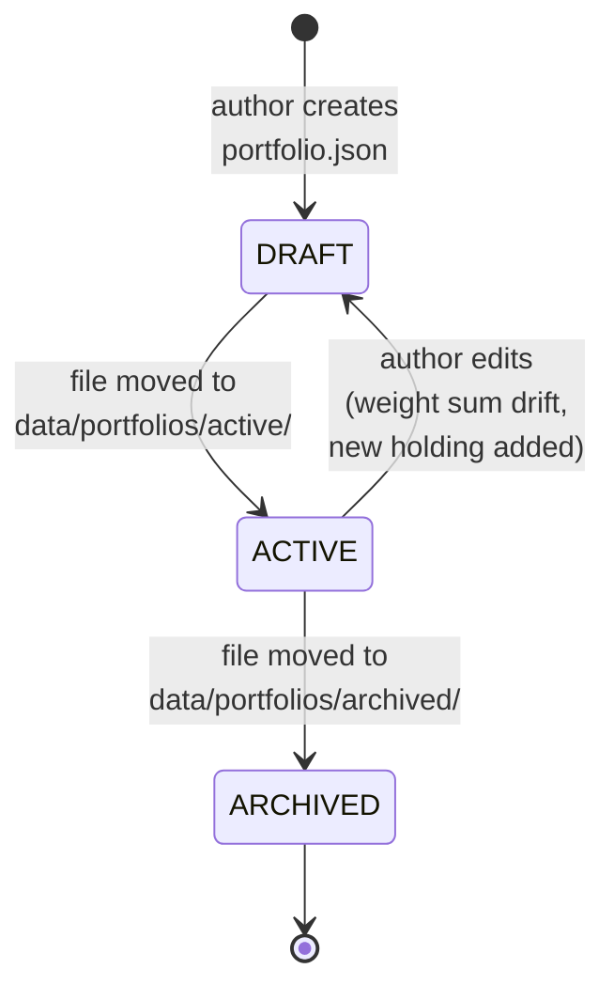

# State Machine — `Portfolio`

> Source: `docs/00.defining.md` Q5.4 and Q5.5. In v1 the Portfolio is
> file-based (a JSON file under `data/portfolios/`); transitions are driven by
> the author editing the file, not by an API. The state machine documents the
> expected lifecycle so a future `Portfolio` API (not in v1) can rely on it.

## Diagram (Mermaid)

## State table

| From | To | Trigger | Guard | Emitted event |
|---|---|---|---|---|
| (none) | `DRAFT` | Author creates a new `portfolio.json`. | Schema validates against `portfolio.schema.json`. | (none — v1 has no event bus for portfolios) |
| `DRAFT` | `ACTIVE` | Author moves the file to `data/portfolios/active/<id>.json`. | `simulate` flag in the file is `true`. | (none) |
| `ACTIVE` | `DRAFT` | Author edits the file (weights change, holding added). | Weight sum still within `1.0 ± 1e-9` after edit. | (none) |
| `ACTIVE` | `ARCHIVED` | Author moves the file to `data/portfolios/archived/<id>.json`. | No `SimulationRun` referencing this `Portfolio` is `RUNNING`. | (none) |

## Forbidden transitions (asserted in tests)

| From | To | Why forbidden |
|---|---|---|
| `ARCHIVED` | `ACTIVE` | **No silent reactivation.** A reactivation must be a deliberate copy to a new file (new `id`) — never a move back. This prevents "ghost" runs that reference a stale, archived portfolio. |
| `ARCHIVED` | `DRAFT` | Same reason. |
| `DRAFT` | `ARCHIVED` | A portfolio cannot be archived before it has been activated at least once. |
| any | `*` (cross-portfolio reuse) | A `SimulationRun` always references a `portfolioId`; the file backing that `id` is immutable for the run's lifetime. Even if the file is later edited, completed runs are reproducible from their persisted `seed` regardless. |

## Invariants (Defining Q1.6, restated)

- `sum(holdings[].weight) == 1.0 ± 1e-9` OR `leverage != 1.0` is explicitly declared.
- `holdings[].symbol` matches `^MOCK-[A-Z]{1,8}$`.
- `holdings[].weight ∈ (-1, 1]` (negative weight = short position, flagged in v1 but tolerated).
- `Portfolio.id` is UUIDv4 and is set at creation; never reused.

## Why no events in v1

The defining doc lists `Portfolio` events as out of scope for v1 (Q1.4
lists only `Simulation*` events). The folder seam `src/domain/portfolio/`
exists so a future `PortfolioEdited`, `PortfolioActivated`, and
`PortfolioArchived` set of events can be added without touching
`SimulationRun`. The state machine above is the contract those future events
will need to honor.
