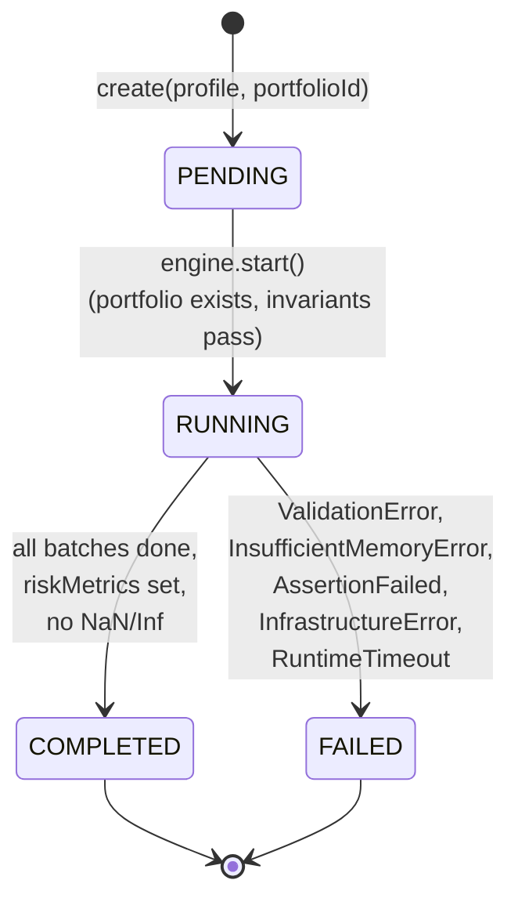

# State Machine — `SimulationRun`

> Source: `docs/00.defining.md` Q5.4 and Q5.5 (entity lifecycles + forbidden
> transitions). Re-stated here as the frozen contract the engine must
> implement. Any new transition requires a new contract schema version bump.

## Diagram (Mermaid)

## State table

| From | To | Trigger | Guard | Emitted event |
|---|---|---|---|---|
| (none) | `PENDING` | CLI parses profile | Profile validates against `simulation_profile.schema.json`; Portfolio exists. | `SimulationRequested` |
| `PENDING` | `RUNNING` | Use case calls `engine.run(run)` | `status == PENDING`; `seed` is set; portfolio loaded. | (none — internal transition; logged via structlog at INFO) |
| `RUNNING` | `COMPLETED` | Engine finishes last batch | `riskMetrics` set; no NaN/Inf in terminal wealth or drawdowns; `outputArtifacts` list is non-empty. | `SimulationCompleted` |
| `RUNNING` | `FAILED` | Any `DomainError` subclass raised mid-run | Invariant violation, memory breach, NaN/Inf, disk full, or wall-clock timeout. | `SimulationFailed` |

## Forbidden transitions (asserted in tests)

| From | To | Why forbidden |
|---|---|---|
| `PENDING` | `COMPLETED` | Engine must always pass through `RUNNING`; skipping leaves no audit trail. |
| `PENDING` | `FAILED` | If validation fails at construction, the run never reaches `PENDING` — `SimulationRequested` was never emitted. A "fail before request" path is a CLI-level validation error, not a `SimulationFailed` event. |
| `COMPLETED` | `RUNNING` | **No resume.** Reproducibility is achieved via `ReplaySimulation` (a new `runId`), not by re-opening a completed run. |
| `COMPLETED` | `FAILED` | **No silent retry-success.** A retry produces a new `runId`. |
| `FAILED` | `COMPLETED` | **No silent retry-success.** Same reason. |
| `FAILED` | `RUNNING` | A failed run is terminal. Re-run with a fresh `runId`. |
| any | `PENDING` | `PENDING` is only entered at creation; runs are immutable once created. |

## Invariants on transitions

1. **`PENDING → RUNNING`** requires:
   - `portfolioId` resolves to an existing `Portfolio`.
   - `seed` is set (either input or generated).
   - `numberOfPaths × horizon × 8 bytes ≤ available memory` (ADR-007 + 300-Q6.6).
2. **`RUNNING → COMPLETED`** requires:
   - `riskMetrics.meanTerminal`, `riskMetrics.stdTerminal`, `varByConfidence`, `cvarByConfidence` are all set.
   - For every `c` in `confidenceLevels`: `cvarByConfidence[c] ≥ varByConfidence[c]` (Defining Q1.6 invariant).
   - All `PathSampled` + `DrawdownComputed` events have been flushed.
   - At least one PNG + `metrics.json` written to `./output/<runId>/`.
3. **`RUNNING → FAILED`** requires:
   - A `SimulationFailed` event is persisted **before** the process exits.
   - The CLI exits with the documented code (Defining 300-Q6.4).
   - `status.json` records `FAILED` so a future replay attempt reads a terminal state.

## Terminal state observability

- The `./output/<runId>/status.json` file is the source of truth for "did this
  run finish?". It is written:
  - once with `"status": "RUNNING"` at the start of `RUNNING → RUNNING` work;
  - overwritten with `"status": "COMPLETED"` or `"status": "FAILED"` at the
    terminal transition.
- The `SimulationCompleted` and `SimulationFailed` events are the corresponding
  append-only records in `events.jsonl`.
