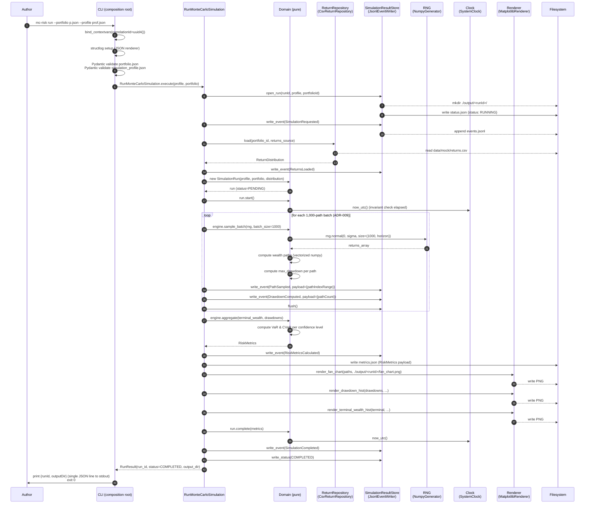

# Data Flow — Sequence Diagrams for Critical Workflows

> Source of truth: `architecture/hexagonal.md` (Port inventory) +
> `docs/100.planning/diagrams/state-machine-simulation-run.md` (lifecycle)
> + `docs/100.planning/contracts/events/envelope.schema.json` (event shape).
>
> This document freezes the **sequence of calls** for the 3 critical
> workflows the Coding phase will implement:
> 1. **`mc-risk run`** — the happy path (a fresh simulation).
> 2. **`mc-risk replay`** — seed-driven reproducibility.
> 3. **`mc-risk compare`** — two portfolios back-to-back.
>
> Failure flows are documented in §4 below.

---

## 1. Happy path: `mc-risk run`

> The author runs `mc-risk run --portfolio p.json --profile prof.json`.
> The CLI parses args, validates the input via Pydantic, builds the
> production `Container`, invokes `RunMonteCarloSimulation.execute()`,
> writes the outputs, exits 0.



### Invariants asserted at the marked points

- **(5)** Portfolio + profile Pydantic validation: weight sum = 1.0 ± 1e-9
  (Defining Q1.6), horizon ∈ [1, 10_000], numberOfPaths ∈ [100, 1_000_000].
- **(11)** Memory budget: `numberOfPaths × horizon × 8 bytes ≤ available RAM`
  (Defining Q2.9). If violated, `ResourceExhaustedError` (CLI exit 4).
- **(14)** Per-batch NaN guard: `assert not np.isnan(terminal_wealth).any()`
  after each batch (Defining Q5.8 threat #3). If violated,
  `AssertionFailed` (CLI exit 5).
- **(20)** CVaR ≥ VaR invariant at every confidence level (Defining Q1.6).
- **(25)** All `PathSampled` + `DrawdownComputed` events flushed before
  `SimulationCompleted` is emitted (state-machine invariant).

### Out-of-band observability

- Every step emits a `structlog` JSON line with `correlationId` and
  `runId` context vars bound (ADR-008).
- On a clean exit, the final stderr line is the `SimulationCompleted` event
  echoed by the logger for grep-ability.

---

## 2. Replay: `mc-risk replay --run-id <runId>`

> The author runs `mc-risk replay --run-id <uuid>`. The CLI reads the prior
> run's `status.json` + `metrics.json` + `events.jsonl`, derives the
> `seed` from `events.jsonl[0].payload`, and re-runs the simulation. The
> new run's `metrics.json` must be **byte-identical** to the original
> (modulo `correlationId` and `occurredAt`, which are stripped before
> comparison). If the bytes diverge, the run aborts with exit code 5.

```mermaid
sequenceDiagram
    autonumber
    participant Author
    participant CLI
    participant UC as ReplaySimulation
    participant RS as SimulationResultStore<br/>(JsonlEventWriter)
    participant RNG as RNG<br/>(NumpyGenerator)
    participant Clock as Clock<br/>(SystemClock)
    participant FS as Filesystem

    Author->>CLI: mc-risk replay --run-id <runId>
    CLI->>CLI: bind_contextvars(correlationId=uuid4())
    CLI->>RS: read_status(runId)
    RS-->>FS: cat ./output/<runId>/status.json
    RS-->>CLI: SimulationStatus
    alt status == RUNNING
        CLI->>Author: error "prior run was corrupt; cannot replay"<br/>exit 5
    else status == COMPLETED or FAILED
        CLI->>UC: ReplaySimulation.execute(runId)
        UC->>RS: read_events(runId)
        RS-->>FS: read events.jsonl
        RS-->>UC: list[EventEnvelope]
        UC->>UC: extract seed from<br/>events[0].payload.profile.seed
        UC->>UC: extract profile + portfolioId from<br/>events[0].payload
        UC->>RNG: numpy.random.Generator(SeedSequence(seed))
        RNG-->>UC: seeded generator
        UC->>Clock: FakeClock(frozen_at=<originalRunStartTime>)
        Clock-->>UC: frozen clock
        UC->>UC: execute engine with seeded RNG + frozen clock
        Note over UC: identical to RunMonteCarloSimulation<br/>but writes to ./output/<runId>/replay/
        UC->>FS: write metrics.json to ./output/<runId>/replay/
        UC->>FS: read original ./output/<runId>/metrics.json
        UC->>UC: byte-equality compare<br/>(strip correlationId, occurredAt)
        alt bytes match
            UC-->>CLI: ReplayResult(matched=True)
            CLI->>Author: print {runId, matched: true}<br/>exit 0
        else bytes diverge
            UC->>FS: write metrics_diff.json
            UC-->>CLI: ReplayResult(matched=False, diff_path=...)
            CLI->>Author: error "replay diverged from original"<br/>exit 5
        end
    end
```

### Why a fresh `runId` is NOT created

`ReplaySimulation` does not generate a new `runId` — it writes its
metrics into `./output/<runId>/replay/` so the original artifacts are
preserved. The original `events.jsonl` is never modified.

---

## 3. Compare: `mc-risk compare --portfolio-a A.json --portfolio-b B.json`

> The author runs a head-to-head comparison of two portfolios. Both
> portfolios are simulated with the same `SimulationProfile` (so the
> comparison is apples-to-apples). Two `runId`s are produced; a
> side-by-side histogram PNG is written to `./output/compare-<runIdA>-<runIdB>/`.

```mermaid
sequenceDiagram
    autonumber
    participant Author
    participant CLI
    participant UC as ComparePortfolios
    participant RR as ReturnRepository
    participant RS as SimulationResultStore
    participant RNG
    participant Renderer

    Author->>CLI: mc-risk compare --portfolio-a A.json --portfolio-b B.json --profile prof.json
    CLI->>CLI: Pydantic validate both portfolios + profile
    CLI->>UC: ComparePortfolios.execute(portfolioA, portfolioB, profile)
    UC->>UC: fork two sub-runs (sequentially, single-threaded)
    UC->>RR: load(portfolioA.id, ...)
    RR-->>UC: ReturnDistribution A
    UC->>RR: load(portfolioB.id, ...)
    RR-->>UC: ReturnDistribution B
    UC->>RS: open_run(runIdA, ...)
    UC->>RS: open_run(runIdB, ...)
    Note over UC: Both runs use the SAME seed (from profile.seed)<br/>so the noise is identical; the comparison is clean.
    loop run A (per batch)
        UC->>RNG: rng.normal(...) (same seed as B)
        UC->>RS: write_event(runIdA, PathSampled, ...)
    end
    UC->>RS: write_event(runIdA, SimulationCompleted, ...)
    loop run B (per batch)
        UC->>RNG: rng.normal(...) (same seed as A)
        UC->>RS: write_event(runIdB, PathSampled, ...)
    end
    UC->>RS: write_event(runIdB, SimulationCompleted, ...)
    UC->>Renderer: render_side_by_side(metricsA, metricsB, ./output/compare-...)
    Renderer-->>UC: PNG written
    UC-->>CLI: CompareResult(runIdA, runIdB, outputDir)
    CLI->>Author: print {runIdA, runIdB, outputDir}<br/>exit 0
```

### Why shared seed, not different seeds

If the two portfolios used different seeds, the noise would confound the
comparison (a 1% VaR difference might be seed noise, not signal). Using
the same seed makes the comparison deterministic: the same shock is
applied to both portfolios on the same day, so VaR differences are pure
allocation effects.

---

## 4. Failure flows

### 4.1 Validation failure (CLI exit 2)

Trigger: Pydantic validation fails on `portfolio.json` or
`simulation_profile.json` (e.g., weight sum ≠ 1.0).

```
CLI catches ValidationError → handle_exception() → prints canonical error
JSON to stderr → exit 2. NO SimulationRequested event is emitted (the run
never reaches PENDING).
```

### 4.2 Portfolio not found (CLI exit 3)

Trigger: `CsvReturnRepository.load()` raises `FileNotFoundError`.

```
CLI catches NotFoundError → handle_exception() → prints canonical error
JSON with the offending file path → exit 3. NO SimulationRequested event.
```

### 4.3 Insufficient memory (CLI exit 4)

Trigger: estimated memory budget
`numberOfPaths × horizon × 8 bytes > available RAM` (Defining Q2.9).

```
Engine raises ResourceExhaustedError BEFORE writing any events. CLI
catches → handle_exception() → exit 4. NO SimulationFailed event (the
run never reached RUNNING; see state-machine forbidden transitions).
```

### 4.4 Assertion failure — NaN/Inf (CLI exit 5)

Trigger: `assert not np.isnan(terminal_wealth).any()` fails mid-run.

```
Engine writes SimulationFailed event with reasonCode="ASSERTION_FAILED"
to events.jsonl (per batch's flush boundary). RS writes
status.json {status: FAILED, failureReasonCode: "ASSERTION_FAILED"}.
CLI catches AssertionFailed → handle_exception() → exit 5.
```

### 4.5 Wall-clock self-timeout (CLI exit 4)

Trigger: a batch's elapsed wall-clock time exceeds
`--max-runtime-seconds / ceil(numberOfPaths / 1000)`.

```
Engine raises ResourceExhaustedError with reasonCode="TIMEOUT".
Same handling as 4.3 — SimulationFailed event is emitted, then exit 4.
```

### 4.6 Infrastructure error — disk full, permission denied (CLI exit 6)

Trigger: `JsonlEventWriter.write_event()` raises `OSError`.

```
The in-flight batch's events may be partially flushed. CLI catches
InfrastructureError → handle_exception() → exit 6. The SimulationFailed
event is the source of truth (status.json is overwritten with FAILED).
```

### 4.7 Crash (no exit code)

Trigger: unhandled exception that escapes `handle_exception()` (e.g.,
segfault, OOM kill by the OS).

```
structlog emits a CRITICAL line with the traceback. The container exits
with code 1 (default for unhandled). ./output/<runId>/status.json is left
in RUNNING state; the next replay attempt (or manual inspection) will
find it corrupt.
```

---

## 5. Cross-flow consistency guarantees

| Guarantee | How it's enforced |
|---|---|
| Every successful run is reproducible byte-for-byte from its persisted `seed`. | `NumpyGenerator(SeedSequence(seed))` + frozen `Clock` (replay flow §2). |
| A run is either `COMPLETED` with full `riskMetrics` OR `FAILED` with a `SimulationFailed` event — never partial. | State-machine forbidden transitions + the `flush()`-per-batch boundary (ADR-009). |
| The `correlationId` ties every log line and every event in a run to the CLI invocation that produced them. | `bind_contextvars` at CLI entry (ADR-008); injected into every envelope. |
| The `seed` is immutable after run creation. | `SimulationRun.seed` is a frozen field (Defining Q1.5 invariant). |
| The JSONL event log is replayable into any future broker. | Envelope shape is frozen in `envelope.schema.json`; ADR-003 documents the migration path. |

---

## 6. Out of scope (documented for future forks)

- **Multi-user / concurrent runs.** The CLI assumes WIP=1 (Defining Q2.2).
  Concurrent runs would require a per-run mutex on `./output/` and a
  rename policy to avoid collisions.
- **Incremental / streaming results.** All artifacts are written at the
  end of the run. A future enhancement could stream `PathSampled` events
  to a dashboard via Server-Sent Events or WebSockets.
- **Cross-run analytics.** The current code reads one run at a time.
  A future `Reporting` context could index all `events.jsonl` files into
  a queryable store — this is the natural CQRS adoption point
  (ADR-011 future trigger).