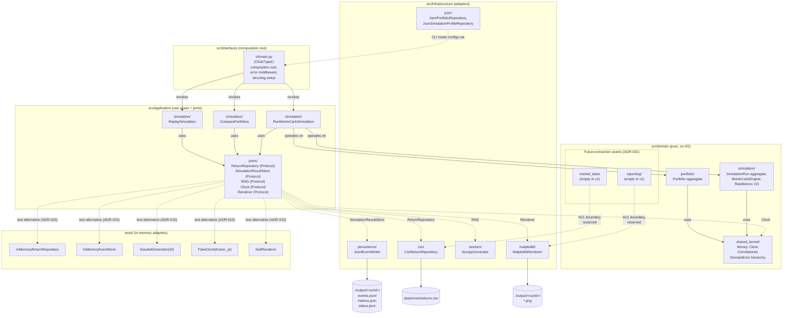

# C4 — Level 2: Container (Design-Time View, with Port+Adapter Wiring)

> Scope: the internal components of the single Docker container, the ports
> between them, and the **Port ↔ Adapter wiring** that the Designing phase
> has frozen per ADR-015 (≥ 2 adapters per port).
>
> Source of truth: `docs/100.planning/diagrams/c4-container.md` (Planning,
> frozen folder layout). This document is the **design-time refinement**:
> same containers, **explicit Port + Adapter pairing** arrows, **future-
> extraction seams** highlighted.

## Diagram (Mermaid)

## Container catalog (matches the folder layout in ADR-002)

| Container | Path | Tech | Responsibility |
|---|---|---|---|
| CLI composition root | `src/interfaces/cli/main.py` | Click/Typer | Parse args, bind `correlationId`, set up `structlog`, wire dependencies, install error middleware. |
| `RunMonteCarloSimulation` | `src/application/simulation/run.py` | pure Python | Use case orchestrating engine + persistence. |
| `ComparePortfolios` | `src/application/simulation/compare.py` | pure Python | Two-portfolio back-to-back. |
| `ReplaySimulation` | `src/application/simulation/replay.py` | pure Python | Reads prior `runId`, re-runs with persisted seed, asserts byte-equality. |
| Ports | `src/application/ports/*.py` | `typing.Protocol` | Interfaces consumed by use cases. |
| `Portfolio` aggregate | `src/domain/portfolio/portfolio.py` | pure Python | Owns `Holding[]` invariants (weight sum, leverage). |
| `SimulationRun` aggregate | `src/domain/simulation/run.py` | pure Python | Owns state machine + invariants. |
| `MonteCarloEngine` | `src/domain/simulation/engine.py` | numpy | The numerical core. |
| Shared kernel | `src/domain/shared_kernel/` | pure Python | `Money`, `Clock`, `CorrelationId`, `DomainError`. |
| `CsvReturnRepository` | `src/infrastructure/csv/` | stdlib `csv` | Adapter for `ReturnRepository` port. |
| `JsonPortfolioRepository` | `src/infrastructure/json/` | stdlib `json` + Pydantic | Adapter for portfolio + profile reads. |
| `JsonlEventWriter` | `src/infrastructure/persistence/` | stdlib `json` + `pathlib` | Adapter for `SimulationResultStore` port (ADR-003). |
| `NumpyGenerator` | `src/infrastructure/random/` | numpy | Adapter for `RNG` port (ADR-006). |
| `MatplotlibRenderer` | `src/infrastructure/matplotlib/` | matplotlib | Adapter for `Renderer` port. |

## Port ↔ Adapter matrix (frozen per ADR-015)

| Port (Protocol) | Production adapter | In-memory / test adapter | Wiring point |
|---|---|---|---|
| `ReturnRepository` | `CsvReturnRepository` | `InMemoryReturnRepository` | Composition root (`Container`) |
| `SimulationResultStore` | `JsonlEventWriter` | `InMemoryEventStore` | Composition root (`Container`) |
| `RNG` | `NumpyGenerator` | `SeededGenerator(42)` | Composition root (`Container`) |
| `Clock` | `SystemClock` (in shared_kernel) | `FakeClock(frozen_at)` | Composition root (`Container`) |
| `Renderer` | `MatplotlibRenderer` | `NullRenderer` | Composition root (`Container`) |

**Rule (ADR-015):** if a Port has only one implementation, the abstraction
is probably wrong. Every PR adding a new Port must also add at least the
in-memory test adapter in the same PR.

## Future-extraction seams (dashed sub-graphs)

The two dashed sub-graphs inside `src/domain/` are folders today. They
become real bounded contexts the day the corresponding capability is
extracted:

- `market_data/` — owns the historical-return series. Becomes a context the
  day a real vendor replaces `CsvReturnRepository` (the `MarketDataAcl`
  adapter is the carve-out).
- `reporting/` — owns chart rendering and any HTML/PDF output. Becomes a
  context the day `MatplotlibRenderer` is replaced by a richer renderer
  (e.g., Plotly / Bokeh / Vega-Lite) that warrants its own aggregate.

## Architectural rule (re-stated from ADR-002 + ADR-010 + ADR-016)

- `src/domain/**` imports ONLY `numpy`, `pydantic`, `decimal`, and `src/domain/**`
  + `src/domain/shared_kernel/**`.
- `src/application/**` imports `src/domain/**`, `src/application/ports/**`.
- `src/infrastructure/**` imports `src/application/ports/**` and `src/domain/**`.
- `src/interfaces/**` imports `src/application/**` and `src/infrastructure/**`
  (for wiring only — ADR-016 hand-rolled composition root).

Violations fail the `import-linter` CI stage (ADR-010).

## Design-time additions (vs. Planning L2)

1. **Explicit Port ↔ Adapter pairing arrows** (dashed). The Planning diagram
   showed ports as a generic block; this diagram names each port's two
   adapters and the wiring point (the composition root).
2. **Test-adapter sub-graph.** The in-memory adapters live under `tests/`,
   not `src/infrastructure/`, to make the production-vs-test boundary
   visible at the container level.
3. **Future-extraction seams** are explicit dashed sub-graphs inside
   `src/domain/`. The Planning diagram listed them as leaf nodes; this
   diagram groups them so the future cost is bounded by the visible surface
   area.