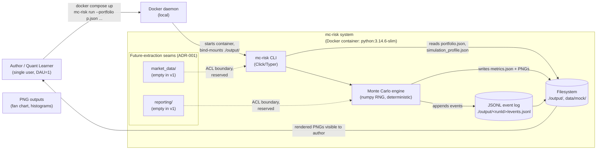

# C4 — Level 1: System Context (Design-Time View)

> Scope: the entire `mc-risk` system as seen by the author (sole stakeholder).
> Source of truth: `docs/100.planning/diagrams/c4-context.md` (Planning,
> frozen). This document is the **design-time refinement** — same shape,
> with annotations that call out the **future-extraction seams** the
> Designing phase has reserved per ADR-001.

## Diagram (Mermaid)

## Element catalog

| Element | Type | Responsibility |
|---|---|---|
| Author / Quant Learner | Person | Sole stakeholder. Owns the laptop. |
| Docker daemon | External system | Runs the `mc-risk` container; bind-mounts `./output/`. |
| mc-risk CLI | Container boundary | Entry point; parses args, validates inputs, wires dependencies. |
| Monte Carlo engine | Container boundary | Runs the simulation; emits events; writes outputs. |
| JSONL event log | File store | Append-only log per run (ADR-003). |
| Filesystem | File store | `./output/`, `data/mock/returns.csv`. |
| `market_data/` (seam) | Internal seam | Reserved for future vendor integration (ADR-001). |
| `reporting/` (seam) | Internal seam | Reserved for future chart/HTML/PDF rendering context (ADR-001). |

## External interfaces

| From | To | Protocol | Notes |
|---|---|---|---|
| Author | Docker daemon | shell | `docker compose up` |
| Docker daemon | CLI | stdin/argv | Container starts; CLI parses args |
| CLI | Filesystem | POSIX read | Portfolio + profile JSON, mock returns CSV |
| Engine | Filesystem | POSIX write | events.jsonl, metrics.json, PNGs |
| Author | Filesystem | POSIX read | Reads PNGs via OS image viewer |

## Design-time additions (vs. Planning L1)

1. **Future-extraction seams shown as internal sub-graphs.** The dashed boxes
   `market_data/` and `reporting/` are folders today, not contexts. They
   become real bounded contexts the day the corresponding capability is
   extracted (ADR-001).
2. **No new external actors.** Still zero third-party integrations (Defining
   Q4.1). The diagram's external surface is identical to the Planning
   snapshot.

## Constraints inherited from Defining + Planning

- **No network.** All I/O is loopback to the author's filesystem.
- **No external vendor.** `MarketData` future-seam is reserved (ADR-001) but
  unused in v1.
- **No concurrent users.** WIP = 1 (Defining Q2.2).
- **$0 / month** cloud budget (Defining Q2.5).
- **CAP = N/A** (ADR-013, single-process).