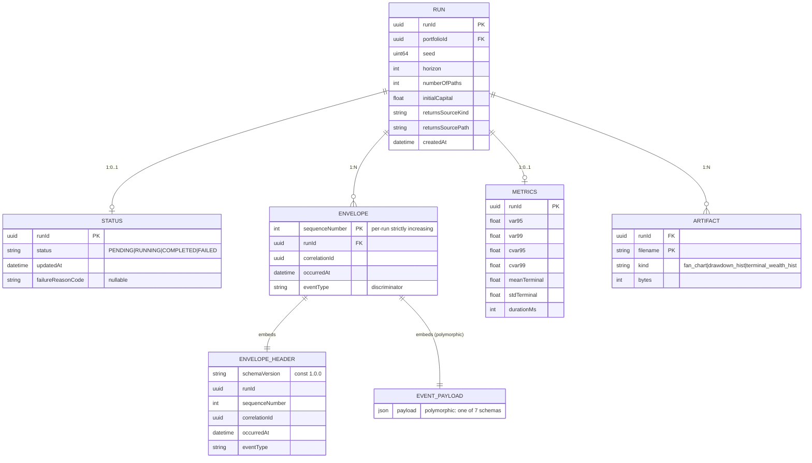

# ERD — Per-Run Persistence (JSONL Event Log + Status File)

> Source of truth: ADR-003 (file-based JSONL store) +
> `docs/100.planning/contracts/events/*.schema.json` +
> `docs/100.planning/diagrams/state-machine-simulation-run.md`.
>
> There is **no database**. The "ERD" describes the on-disk shapes of the
> artifacts a single simulation run produces. Each `runId` corresponds to
> one directory under `./output/<runId>/`. The shapes are JSON Schemas
> frozen in `docs/100.planning/contracts/` and regenerated by `make contracts`
> (ADR-004).

## Storage layout per run

```
./output/<runId>/
├── status.json            # source of truth for terminal state
├── events.jsonl           # append-only event log (one envelope per line)
├── metrics.json           # final riskMetrics payload (written on COMPLETED)
├── fan_chart.png          # MatplotlibRenderer output
├── drawdown_hist.png      # MatplotlibRenderer output
└── terminal_wealth_hist.png   # MatplotlibRenderer output
```

`runId` is a UUIDv4 (Defining 200-Q1.2). The directory is created atomically
when the run enters `RUNNING`.

## Diagram (Mermaid)



## Entity descriptions

### `RUN` — the logical run

**Not a separate file** — `RUN` is the implicit identity behind a
directory. Its fields are reconstructed by reading `status.json` +
the first event (`SimulationRequested`) + the final event (`SimulationCompleted`
or `SimulationFailed`) of `events.jsonl`.

Fields shown in the ERD are a denormalized view of those three sources. A
future `Reporting` context (per ADR-001) could persist a single `run.json`
to make this trivial.

### `STATUS` — `./output/<runId>/status.json`

The **source of truth** for "did this run finish, and how?" The CLI writes
it at:

| Run state transition | `status.json` content |
|---|---|
| `PENDING → RUNNING` | `{"status": "RUNNING", "updatedAt": <now>}` |
| `RUNNING → COMPLETED` | `{"status": "COMPLETED", "updatedAt": <now>}` |
| `RUNNING → FAILED` | `{"status": "FAILED", "failureReasonCode": "...", "updatedAt": <now>}` |

A `ReplaySimulation` call that finds `status.json.status == RUNNING` knows
the prior run was corrupt and refuses to replay it (forces the user to
re-run with a fresh `runId`).

Schema: implicit; not a JSON Schema document, but a 3-line Pydantic model
defined in `src/domain/simulation/status.py`.

### `ENVELOPE` — `./output/<runId>/events.jsonl` (one row per line)

Append-only. Strictly increasing `sequenceNumber` per `runId`. Every row
matches `contracts/events/envelope.schema.json` (the envelope) plus
`contracts/events/<event_type>.schema.json` (the payload, discriminated by
`eventType`).

The writer (`JsonlEventWriter`) is `flush()`ed at the end of each 1,000-path
batch (ADR-009). A crash loses at most one batch.

### `ENVELOPE_HEADER`

Frozen as `envelope.schema.json`. The 7 `eventType` values are an `enum`:

| `eventType` | Payload schema |
|---|---|
| `SimulationRequested` | `simulation_requested.schema.json` |
| `ReturnsLoaded` | `returns_loaded.schema.json` |
| `PathSampled` | `path_sampled.schema.json` |
| `DrawdownComputed` | `drawdown_computed.schema.json` |
| `RiskMetricsCalculated` | `risk_metrics_calculated.schema.json` |
| `SimulationCompleted` | `simulation_completed.schema.json` |
| `SimulationFailed` | `simulation_failed.schema.json` |

### `EVENT_PAYLOAD` (polymorphic)

Discriminated by `ENVELOPE_HEADER.eventType`. JSON Schema is generated
from Pydantic models in `src/domain/simulation/events.py` (ADR-004). Each
payload schema is a frozen snapshot in
`docs/100.planning/contracts/events/`.

### `METRICS` — `./output/<runId>/metrics.json`

Written once at `RUNNING → COMPLETED`. A failed run does NOT produce a
`metrics.json` (the `SimulationFailed` event payload carries the
failure detail instead).

Schema: `risk_metrics_calculated.schema.json` (the same payload that is
emitted as the `RiskMetricsCalculated` event is also persisted to
`metrics.json`).

### `ARTIFACT` — `./output/<runId>/*.png`

PNGs written by `MatplotlibRenderer`. The set of PNGs is **not** enumerated
in JSONL — the author reads the directory directly. A future enhancement
could append `ArtifactWritten` events, but Defining Q1.4 already lists this
as "out of scope for v1."

## Cardinalities (concrete)

| Relationship | Cardinality | Reason |
|---|---|---|
| `RUN → STATUS` | 1:0..1 | `status.json` is written at least once when the run enters `RUNNING`. |
| `RUN → ENVELOPE` | 1:N | `N` = number of events emitted (typically 5 + ⌈paths/1000⌉ × 2 for a 10k run → ~25). |
| `RUN → METRICS` | 1:0..1 | Only `COMPLETED` runs have `metrics.json`. |
| `RUN → ARTIFACT` | 1:N | `N` ∈ {1, 2, 3} typically (fan chart + 1–2 histograms). |

## Indexes (filesystem-level)

There are no indexes in the database sense. The "index" is the directory
structure:

```
./output/<runId>/...    # per-run contents
```

To find a run: `ls ./output/`. To enumerate events: `cat
./output/<runId>/events.jsonl | jq`. To check terminal state:
`cat ./output/<runId>/status.json | jq -r .status`. The CLI smoke test
is the only automated consumer.

## Future migration path

When (if) a database is introduced per ADR-012, the JSONL log becomes the
**event-sourcing seed**: each `ENVELOPE` row maps 1-to-1 to a row in an
`events` table; `status.json` maps to a `runs` table; `metrics.json` maps to
a `risk_metrics` table. The `SimulationResultStore` port absorbs the change;
no domain code is touched.