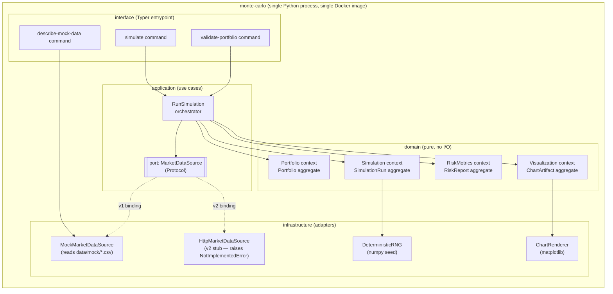

# C4 — Container (Level 2)

> Frozen on: 2026-06-23
> Source: `00.defining.md` §2 Bounded Contexts; `01.planning.md` §1, §4; ADR-001 (hexagonal).
> Companion file: `c4-context.md` (Level 1).

## Diagram (Mermaid)



## Elements

| Container | Layer | Purpose | Source |
|---|---|---|---|
| **`simulate` / `validate-portfolio` / `describe-mock-data` commands** | `interface/` | Typer CLI entrypoints. Validate argv against `cli-contract.yaml`. Catch all exceptions, emit canonical JSON error to stderr. | `cli-contract.yaml` |
| **`RunSimulation` orchestrator** | `application/` | The single use case. Sequences `Portfolio → MarketDataLoad → Simulation → RiskMetrics → Visualization`, emits domain events with a `run_id` envelope, and enforces the event ordering invariant from `events.schema.json`. | `01.planning.md` §1 Event Storming |
| **`MarketDataSource` port** | `application/ports/` | A Python `Protocol`. The orchestrator depends on this; concrete adapters implement it. | ADR-003 |
| **`Portfolio` aggregate** | `domain/portfolio/` | Owns the `Portfolio`, `Holding`, `Ticker`, `Weight` value objects. Validates the weights-sum-to-one invariant. | `00.defining.md` §2 Bounded Contexts |
| **`SimulationRun` aggregate** | `domain/simulation/` | Owns the path-generation math via `numpy`. Pure; no I/O. See state-machine diagram. | `00.defining.md` §2 Bounded Contexts; ADR-002 |
| **`RiskReport` aggregate** | `domain/risk_metrics/` | Computes VaR, CVaR, max-drawdown distribution, terminal-wealth distribution from a `PathSet`. Pure. | `00.defining.md` §2 Bounded Contexts |
| **`ChartArtifact` aggregate** | `domain/visualization/` | **Owns the chart contract** (which charts exist, what they show). The actual rendering (`matplotlib`) is in `infrastructure/`. | `00.defining.md` §2 Bounded Contexts; ADR-001 (matplotlib forbidden in domain) |
| **`MockMarketDataSource`** | `infrastructure/` | Reads bundled CSV corpus from `data/mock/`. Implements `MarketDataSource`. The v1 binding. | ADR-003 |
| **`HttpMarketDataSource`** | `infrastructure/` | **v2 stub.** Raises `NotImplementedError`. Includes a contract test marked `@pytest.mark.xfail(reason="v2 — gated by Spike S-001")`. | ADR-003; Spike S-001 |
| **`ChartRenderer`** | `infrastructure/` | Takes a `ChartArtifact` specification and writes PNG via `matplotlib`. | ADR-001 |
| **`DeterministicRNG`** | `infrastructure/` | Wraps `numpy.random.default_rng(seed)` for reproducibility (NFR-4). | ADR-001; NFR-4 |

## Layer Boundaries (enforced by `import-linter` per ADR-001)

```
interface/   ──▶ application/, domain/, infrastructure/
application/ ──▶ domain/
              └─▶ application/ports/ (Protocol definitions only)
infrastructure/ ──▶ domain/, application/
domain/      ──▶ (nothing else inside the project)
```

The diagram above respects these boundaries: arrows never cross from `domain/` outward, only inward from `application/` or `infrastructure/`.

## Notes

- All containers live in a **single Python process** inside a **single Docker image**. The C4 "Container" level here maps to "module/package" inside one binary, not to OS-level containers.
- There is no database container, no broker container, no cache container. This is deliberate (ADR-004) and is a consequence of the $0/month cloud budget and the single-CLI-process decision (ADR-005).
- The dashed arrows from `MarketDataSource` to `MockMarketDataSource` / `HttpMarketDataSource` indicate dependency-inversion bindings selected at runtime by the `--provider` CLI flag (default `mock`).
