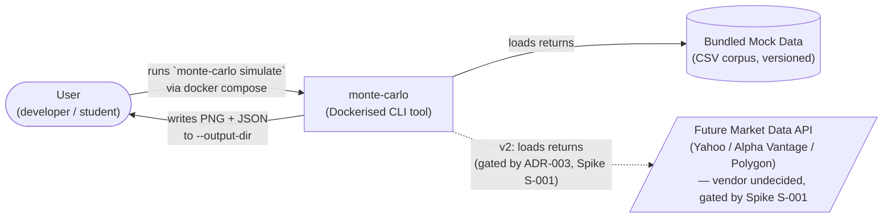

# C4 — System Context (Level 1)

> Frozen on: 2026-06-23
> Source: `00.defining.md` §1, §2; `01.planning.md` §1, §4.
> Companion file: `c4-container.md` (Level 2).

## Diagram (Mermaid)

## Elements

| Element | Type | Description | Source |
|---|---|---|---|
| **User** | Person | Single developer (jcarloshg) plus other students who clone the repo. Interacts only via the CLI / Docker. | `00.defining.md` §1 Domain & Flow |
| **monte-carlo** | Software System | The CLI tool itself. A single Python process packaged as a Docker image. Exposes three commands (`simulate`, `validate-portfolio`, `describe-mock-data`) per `contracts/cli-contract.yaml`. | `01.planning.md` §4 CLI Contract |
| **Bundled Mock Data** | Data Store | A versioned CSV corpus checked into the repo under `data/mock/`. The v1 source of historical return distributions. | `00.defining.md` §1 Dependencies; ADR-003 |
| **Future Market Data API** | External System | The v2 third-party market-data vendor. Undecided between Yahoo Finance / Alpha Vantage / Polygon. **Not integrated in v1** — gated by Spike S-001. Drawn with dashed border and dashed arrow to indicate "future." | `00.defining.md` §1 Dependencies; ADR-003; Spike S-001 |

## Notes

- This is the entire external surface. There is no database, no message broker, no cache, no reverse proxy, no cloud service. The diagram is intentionally empty.
- The "Future Market Data API" is drawn now to make the v2 seam visible to future contributors. It is a placeholder, not a commitment to any specific vendor.
- The C4 Context level intentionally does **not** show the four bounded contexts — they appear in `c4-container.md`.
