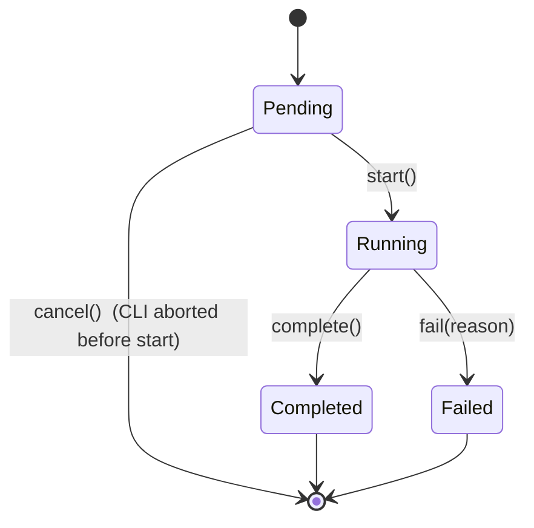

# State Machine — `SimulationRun`

> Frozen on: 2026-06-23
> Source: `00.defining.md` §2 Bounded Contexts (Simulation); `01.planning.md` §1 Bounded Contexts; ADR-001.

## Diagram (Mermaid)

## States

| State | Meaning | Held invariants |
|---|---|---|
| **Pending** | Aggregate exists; no paths generated yet. Constructor only. | `n_paths > 0`, `horizon > 0`, `seed` is set. |
| **Running** | Path generation is in progress. | At least one partial batch exists in memory; no terminal stats are reportable yet. |
| **Completed** | All `n_paths` finished; `PathSet` is final. | `PathSet.shape.n_paths == self.n_paths`; `terminal_wealth.shape == (n_paths,)`; `max_drawdown_per_path.shape == (n_paths,)`. |
| **Failed** | Path generation aborted with a typed reason. | `error_reason` is non-empty; no partial `PathSet` is exposed. |

## Legal Transitions

| # | From | To | Trigger | Pre-condition | Post-condition |
|---|---|---|---|---|---|
| 1 | (none) | `Pending` | Constructor `SimulationRun(parameters, portfolio, return_matrix)` | Parameters validate; portfolio resolves to weights summing to 1.0; return matrix matches universe. | Aggregate created; no work done. |
| 2 | `Pending` | `Running` | `start()` | All dependencies injected; pre-flight checks pass. | RNG seeded; emission of `SimulationStarted` event. |
| 3 | `Running` | `Completed` | `complete(path_set)` | `path_set.shape.n_paths == n_paths`. | `PathSet` stored; emission of `SimulationCompleted` event. |
| 4 | `Running` | `Failed` | `fail(reason)` | `reason` is a non-empty `str` or a typed exception. | `error_reason` stored; emission of `SimulationFailed` event (out-of-band — not in `events.schema.json` v1; tracked in stderr logs). |
| 5 | `Pending` | (terminal) | CLI abort / signal | n/a | No event emitted; no resources to release. |
| 6 | `Completed` | (terminal) | n/a | n/a | Final state. |
| 7 | `Failed` | (terminal) | n/a | n/a | Final state. |

## Forbidden Transitions (explicitly rejected)

These transitions MUST be rejected at runtime by the aggregate. A request that would perform them raises `InvalidSimulationTransition` (error code `invalid_simulation_transition`).

| # | From | To | Why forbidden |
|---|---|---|---|
| F1 | `Running` | `Pending` | Cannot "un-run" a simulation. Re-running requires a new `SimulationRun` aggregate (new `run_id`). |
| F2 | `Completed` | `Running` | A completed run is immutable. To re-simulate, create a new aggregate. |
| F3 | `Failed` | `Running` | A failed run must be diagnosed before retry. Retry requires a new aggregate with a new seed or fixed inputs. |
| F4 | `Completed` | `Failed` | Once `Completed`, the result is final. Failure can only happen during `Running`. |
| F5 | `Failed` | `Completed` | A failed run never silently becomes completed. |
| F6 | `Pending` | `Completed` | Must pass through `Running`. Skipping the state loses observability and the `SimulationStarted` event. |
| F7 | `Pending` | `Failed` | A `Pending` aggregate has done no work and cannot have failed. Use transition #5 (CLI abort). |

## Concurrency

- A single `SimulationRun` is **not** thread-safe. The CLI runs single-threaded; concurrent access from multiple threads is forbidden.
- Multiple `SimulationRun` aggregates MAY exist simultaneously under different `run_id`s (e.g., a future batch mode). They do not share state.

## Notes

- The state machine is enforced by the aggregate's methods (`start()`, `complete()`, `fail()`), which check the current state before mutating and raise `InvalidSimulationTransition` on illegal moves.
- This is a **one-shot** state machine: there is no `reset()` or `retry()`. Reproducibility (NFR-4) is achieved by running a new aggregate with the same `(seed, portfolio, n_paths, horizon)`, not by reusing a previous aggregate.
- `Portfolio`, `RiskReport`, and `ChartArtifact` are value-object-shaped and have no lifecycle of their own; no state machines are required for them.
