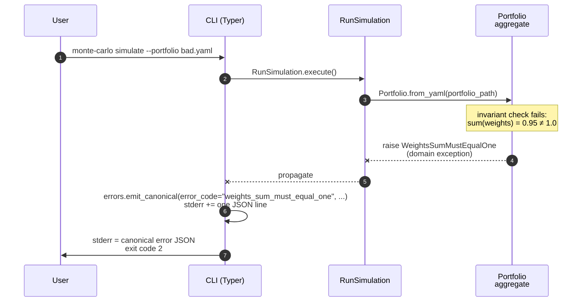
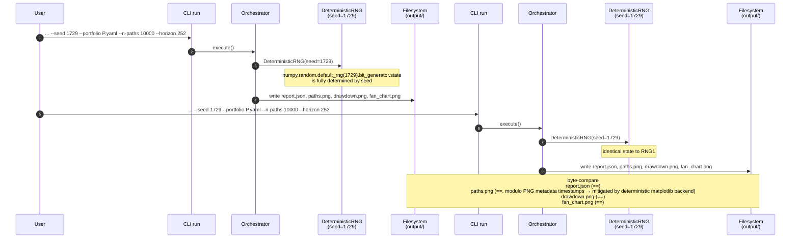

# Architecture — Data Flow (Sequence Diagrams)

> Frozen on: 2026-06-23
> Source: Planning §1 Event Storming; `contracts/events.schema.json`; ADR-006 (modular monolith), ADR-007 (hexagonal).
> Consuming phase: 300 (Coding).

Four sequence diagrams cover every critical code path in v1. Each diagram uses Mermaid and labels every arrow with the **domain event** that the source emits after the call completes (matching `events.schema.json`).

---

## 1. Happy Path — `monte-carlo simulate`

The full pipeline. Single process, single thread, synchronous orchestration.

```mermaid
sequenceDiagram
    autonumber
    participant U as User
    participant CLI as CLI (Typer)
    participant ORCH as RunSimulation<br/>(orchestrator)
    participant PORT as Portfolio<br/>aggregate
    participant MDS as MarketDataSource<br/>(adapter)
    participant SIM as SimulationRun<br/>aggregate
    participant RNG as DeterministicRNG<br/>(adapter)
    participant RM as RiskReport<br/>aggregate
    participant VIZ as ChartArtifact<br/>aggregate
    participant CR as ChartRenderer<br/>(adapter)
    participant OW as OutputWriter<br/>(adapter)
    participant FS as Filesystem

    U->>CLI: monte-carlo simulate --portfolio portfolio.yaml --seed 1729 ...
    CLI->>CLI: parse argv; validate against cli-contract.yaml
    CLI->>ORCH: RunSimulation(portfolio_path, n_paths, horizon, seed, ...).execute()
    ORCH->>PORT: Portfolio.from_yaml(portfolio_path)
    PORT-->>ORCH: Portfolio  (emits PortfolioDefined)
    ORCH->>MDS: data_source.load(universe=Portfolio.tickers)
    MDS-->>ORCH: ReturnMatrix  (emits MarketDataLoaded)
    ORCH->>SIM: SimulationRun(parameters, portfolio, return_matrix).start()
    SIM->>RNG: rng.spawn(seed)  (per-path sub-stream)
    loop for each of n_paths paths
        SIM->>RNG: rng.normal(...)  (sample daily returns)
        RNG-->>SIM: ndarray of shape (horizon,)
        SIM->>SIM: accumulate Path into PathSet
    end
    SIM-->>ORCH: PathSet  (emits SimulationCompleted; transitions to Completed)
    ORCH->>RM: RiskReport.from_path_set(path_set, confidence)
    RM-->>ORCH: RiskReport  (emits RiskMetricsCalculated)
    ORCH->>VIZ: ChartArtifact.create(...) × 3 (paths, drawdown, fan_chart)
    VIZ-->>ORCH: [ChartArtifact × 3]
    loop for each ChartArtifact
        ORCH->>CR: renderer.render(artifact, output_path)
        CR-->>ORCH: None  (PNG written to FS)
    end
    ORCH-->>CLI: SimulationReport  (emits ChartsRendered)
    CLI->>OW: output_writer.write_json(report_json_path, simulation_report_dict)
    OW->>FS: write
    CLI->>U: stdout = SimulationReport JSON (matches cli-contract.yaml)<br/>exit code 0
```

**Key invariants exercised:**
- `SimulationRun` follows the legal state machine transitions (Planning `state-machine-simulation-run.md`): `Pending → Running → Completed`.
- All six domain events emitted in the frozen order from `events.schema.json` invariant #2.
- The `run_id` envelope is added by the orchestrator at every event emission.
- Idempotency (NFR-5): the same `(seed, portfolio, n_paths, horizon, mock_data_version)` produces byte-identical outputs.

---

## 2. Portfolio Validation Failure — Early Exit

`validate-portfolio` command, OR `simulate` invoked with a portfolio whose weights do not sum to 1.0.



**Key invariants exercised:**
- Domain raises a typed exception (`WeightsSumMustEqualOne`), NOT a generic `ValueError`.
- The CLI's `errors.py` is the **only** place that knows the canonical error envelope shape; the domain knows nothing about it.
- Exit code `2` matches `cli-contract.yaml` §`exit_codes` for `simulate`.

---

## 3. `--provider http` Invocation in v1 (Spike-Gated Failure)

User tries to invoke the v2 HTTP provider before Spike S-001 has completed and the v2 adapter has been implemented.

```mermaid
sequenceDiagram
    autonumber
    participant U as User
    participant CLI as CLI (Typer)
    participant ORCH as RunSimulation
    participant MDS as MarketDataSource<br/>(selected adapter)
    participant HTTP as HttpMarketDataSource<br/>(v2 stub)

    U->>CLI: monte-carlo simulate --provider http --portfolio ...
    CLI->>ORCH: RunSimulation.execute()
    ORCH->>MDS: data_source.load(universe)
    Note over MDS: --provider=http selected at composition root;<br/>HttpMarketDataSource bound
    MDS->>HTTP: delegate to v2 stub
    HTTP--xMDS: raise NotImplementedError("v2 — gated by Spike S-001")
    MDS--xORCH: propagate as MarketDataLoadError<br/>(wrapped at adapter boundary)
    ORCH--xCLI: propagate
    CLI->>CLI: errors.emit_canonical(error_code="provider_not_implemented", ...)<br/>stderr += one JSON line
    CLI->>U: stderr = canonical error JSON<br/>exit code 3
```

**Key invariants exercised:**
- The composition root's `--provider` flag selects the adapter at startup; the orchestrator never sees the choice.
- The v2 stub's `NotImplementedError` is wrapped by the adapter into a typed `MarketDataLoadError` so the orchestrator's error handling remains uniform.
- `error_code = "provider_not_implemented"` matches the enum in `cli-contract.yaml` §`error_schema`.
- Exit code `3` matches `cli-contract.yaml` §`exit_codes` for `simulate`.

---

## 4. Deterministic Re-Run — Reproducibility (NFR-4)

Two consecutive invocations with identical `(seed, portfolio, n_paths, horizon, mock_data_version)`. The output artifacts must be **byte-identical** (NFR-5).



**Determinism guarantees (must hold):**
- `numpy.random.default_rng(1729)` is deterministic across Python processes on the same platform (PCG-64 bit generator).
- `matplotlib` rendering is deterministic when:
  - `matplotlib.use("Agg")` (non-interactive backend) is set before any pyplot import.
  - A fixed `matplotlib.rcParams` set is used (no random style application).
  - PNG metadata timestamps are stripped or pinned via Pillow's `PngImagePlugin`.
- The orchestrator must use the **same** RNG instance for all paths within one run (per-path `rng.spawn(...)` for independence, but each spawn uses a deterministic seed derived from the parent seed).
- Cross-platform determinism is **not** guaranteed: floating-point reduction order can differ across BLAS implementations. NFR-4 is asserted **per-platform** (CI runs on a pinned image).

---

## Cross-cutting Notes

- **No I/O in domain.** Every file write in diagrams 1, 3, and 4 happens through a Protocol-implementing adapter (`OutputWriter`, `ChartRenderer`, `ReturnMatrixLoader`). The domain aggregates return value objects; the application use case is the only place that knows about the filesystem.
- **One run, one thread, one process.** No concurrency, no async, no multiprocessing in v1. `numpy` parallelism is the only place multiple cores are used (via its internal BLAS threads); this is deterministic for a fixed BLAS backend.
- **Error envelope.** Every failed diagram ends with `errors.emit_canonical(...)` writing exactly one canonical JSON line to stderr, matching `cli-contract.yaml` §`error_schema`. The domain knows nothing about this envelope.
