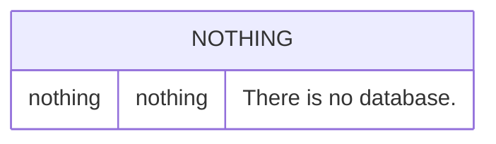
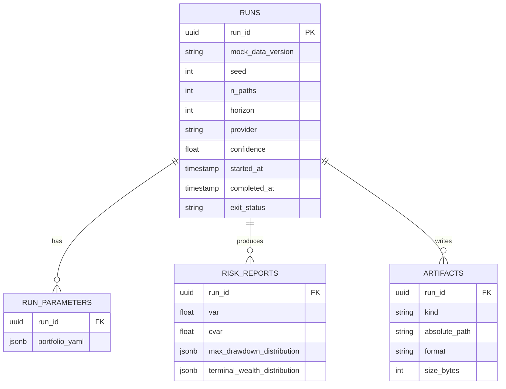

# DB ERD — Zero Datastores

> Frozen on: 2026-06-23
> Source: Planning ADR-004 (no persistence); Design ADR-009 (zero datastores).

## The diagram

(Yes, this is intentionally empty. See ADR-009.)

## What lives where instead

| What | Where | Lifecycle |
|---|---|---|
| Bundled mock market data | `data/mock/*.csv` (filesystem, checked into git) | Read-only at runtime. Versioned by git. The `mock_data_version` field in `ReturnMatrix` (per `events.schema.json`) is derived from `git describe --tags --always` of the repo at run time. |
| Per-run output artifacts | `--output-dir` (filesystem, default `./output`) | Written by `OutputWriter`. Overwritten on re-run with same seed. Not gitignored by the project (user's choice). |
| Runtime in-memory state | Process memory | Lives for the duration of one CLI run. Garbage-collected on exit. |
| Logging output | stderr | Streamed to stderr; nothing persisted. |
| Run identity | `--run-id` (uuid4) | Generated per run unless supplied. Embedded in artifact filenames and log lines for traceability within the run. |

## Why no DB

Recorded in `adr/009-zero-datastores.md` §Context and §Decision. Summary:

- $0/month cloud budget (NFR-8) — no managed Postgres, no SQLite, no DynamoDB, no Parquet on S3.
- Single-user educational tool — no historical-comparison requirement across users or machines.
- Reproducibility (NFR-4) is achieved from CLI inputs + RNG seed alone. A DB would add nothing.
- The `--output-dir` filesystem output IS the "database" for any cross-run comparison the user wants to do manually.

## What the DB ERD would look like in v2 (if persistence is added)

If a future ADR supersedes ADR-009 and adds persistence, the schema would minimally need:

But this is **not** committed code or schema — it is a sketch for v2 contributors who would need to write ADR-013 (or higher) to authorize persistence. Until then, it stays in this comment.

## Anti-patterns explicitly rejected by ADR-009

- **Database-driven design.** No ORM, no schema migrations, no `Base = declarative_base()`.
- **God database.** Even in v2, the schema above is owned by `monte-carlo-risk` alone; no other service connects to it.
- **CAP trade-off.** See `adr/010-cap-ap.md` — AP stance carries forward if a DB is added.
